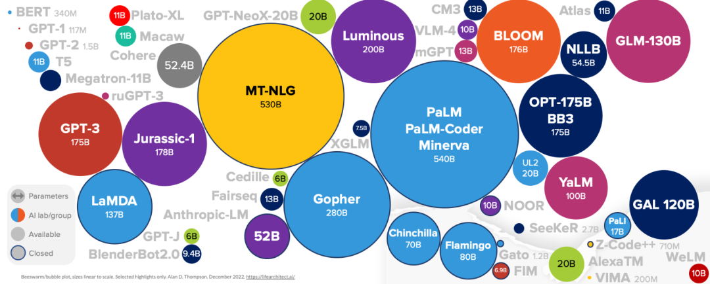

# Awesome-Chinese-LLM

以ChatGPT为代表的大语言模型(LLM)展现出成为通用人工智能(AGI)的潜力，并受到~~NLP社区~~社会各界的广泛关注。然而，目前整理LLM的项目大多以整理英文语料和英文LLM为主，这为构建高质量的中文对话大模型形成阻碍。

为了促进中文LLM的发展，本项目整理了可用的中文大模型，中文开源数据，也欢迎大家继续在此基础上补充，一起为中文大模型的发展添砖加瓦。

* Awesome-Chinese-LLM
  * 中文大模型
  * 开源数据
* Coming soon
  * 中文大模型测评

# 中文大模型

https://github.com/LianjiaTech/BELLE 基于BLOOM和LLAMA针对中文做了优化

https://github.com/THUDM/GLM 清华THUDM开源的中/英预训练模型

https://github.com/THUDM/ChatGLM-6B 清华THUDM开源的双语对话模型

https://github.com/PhoebusSi/Alpaca-CoT 在Alpaca基础上使用CoT数据调整

https://github.com/ymcui/Chinese-LLaMA-Alpaca/tree/v1.0 中文LLaMA&Alpaca大语言模型+本地部署

# 开源数据

https://github.com/XueFuzhao/InstructionWild colossal-ai的self-instruct数据集，中英。

https://github.com/LianjiaTech/BELLE/blob/main/zh_seed_tasks.json 链家的self-instruct数据集

https://huggingface.co/datasets/BelleGroup/generated_train_1M_CN 链家参考[Stanford Alpaca](https://github.com/tatsu-lab/stanford_alpaca) 生成的中文数据集1M

https://huggingface.co/datasets/BelleGroup/generated_train_0.5M_CN 链家参考[Stanford Alpaca](https://github.com/tatsu-lab/stanford_alpaca) 生成的中文数据集0.5M

# 中文大模型测评

待补充。。。